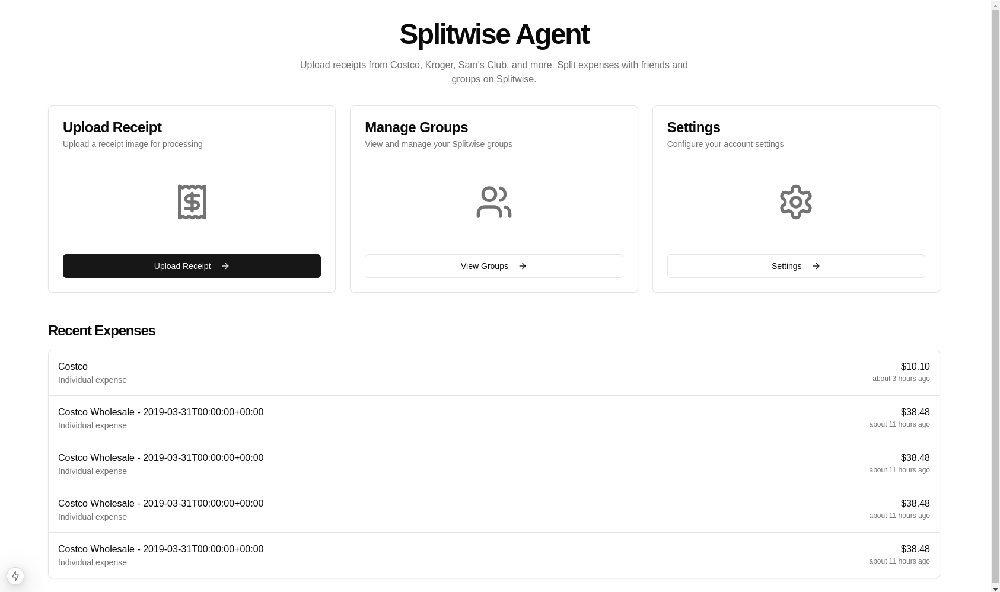

# Splitwise Agent Service

A scalable backend service that leverages AI agents for processing receipt images and interacting with the Splitwise API. This service automates the reading of receipts, extraction of relevant information, and creation of expense entries in Splitwise.

## Features
- REST API for interacting with Splitwise
- Multi-agent system for receipt processing
- Multi-modal model integration for receipt OCR
- Automated expense entry creation
- Scalable architecture

## Setup Instructions
1. Clone the repository.
2. Install dependencies:
   ```bash
   pip install -r requirements.txt
   ```
3. Set up environment variables:
   ```bash
   cp .env.example .env
   # Edit .env with your credentials
   ```
   Required environment variables include:
   - **Splitwise Configuration**:
     ```
     SPLITWISE_CONSUMER_KEY=your_consumer_key
     SPLITWISE_CONSUMER_SECRET=your_consumer_secret
     SPLITWISE_API_KEY=your_api_key
     ```
   - **AWS S3 Configuration (for receipt storage)**:
     ```
     AWS_ACCESS_KEY_ID=your_access_key_id
     AWS_SECRET_ACCESS_KEY=your_secret_access_key
     AWS_REGION=your_region  # defaults to us-east-1
     AWS_S3_BUCKET=your_bucket_name
     ```
   - **OpenAI Configuration**:
     ```
     OPENAI_API_KEY=your_api_key
     ```
4. Run the service:
   ```bash
   python -m src.main
   ```

## API Documentation
The service exposes RESTful endpoints for:
- Receipt image upload and processing
- Direct Splitwise interactions
- Agent status monitoring

Detailed API documentation is available at `/docs` when running the service.

## Architecture
The service utilizes:
- FastAPI for REST API
- CrewAI for multi-agent orchestration
- Splitwise SDK for API integration
- Multi-modal models for receipt processing
- AWS S3 for secure receipt image storage



## License
MIT License